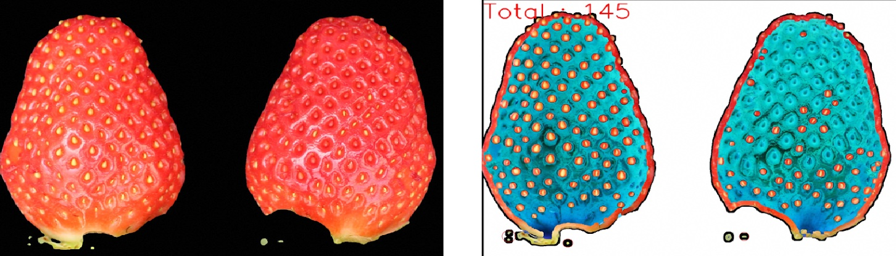
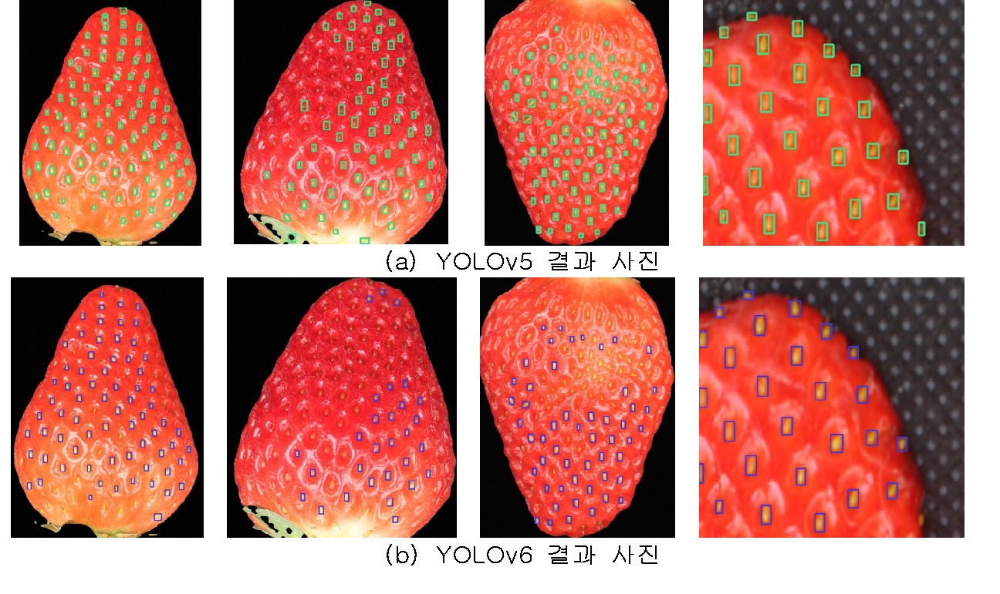

# Counting Strawberry Achene


Image Processing by OpenCV             |  YOLOv5 & YOLOv6
:-------------------------:|:-------------------------:
  |  

This is the code of the paper "Counting Strawberry Achene: Comparison of Object Detection Based on Deep Learning and OpenCV Image Processing"


# Base repository
Deep learning mechanism was tested on the below. 
Check the specific tutorial on the below.
- YOLOv5: https://github.com/ultralytics/yolov5/tree/7f5724ba4b3e421d4c9162742810c52248d06ecd 
- YOLOv6: https://github.com/meituan/YOLOv6/tree/c59ef99693e06e8495c5defdeef5b848f9847ec0

# Usage
## Image Processing

- ```main.py```: run
- ```achene.py```: get the number of achene
- ```util.py```: functions to preprocess and to bundle OpenCV functions
- ```cluster.py```: split background and strawberry by K-means


## YOLOv5

I changed detect.py to save the number of achene and the color of the box. The code is following. 
```py
# Save csv file, the number of achene
with open("output.csv", "a") as f:
    f.write(f"{p.name}, {len(det)}\n")

# Change the color of the box outline
annotator.box_label(xyxy, label, color=colors(c + 7, True))
```


Training

```
!python3 train.py --img 640 --batch 3 --epochs 100 --data achene.yaml --weights yolov5n.pt --cache
```

Validation

```
!python3 val.py --weights runs/train/exp2/weights/best.pt --save-txt --data achene.yaml --img 640 --half
```

Detect

```
!python3 detect.py --weights runs/train/exp2/weights/best.pt --save-txt --nosave  --img 640 --conf 0.25 --source ../data/full_image --hide-label --hide-conf
```


## YOLOv6

Training
```
!python3 ./tools/train.py --epochs 10 --batch 32 --conf-file ./configs/yolov6n.py --data ./strflower.yaml 
```

Evaluation

```
!python3 eval.py --weights runs/train/exp31/weights/best_ckpt.pt --data strflower.yaml --img 640
```

Inference
```
!python3 tools/infer.py --weights runs/train/exp21/weights/best_ckpt.pt --source ../data/flowerdata/images/test/20201209_M-4_1.JPG --hide-labels
```

# Dataset Directory
## Image Processing
```
dataset/
├── done
    ├── blob
    └── diff
├── etc
├── original
├── original_crop
├── original_full
└── segment
```
## YOLOv5
```
datasets/
├── test
    ├── images
    └── labels
├── train
    ├── images
    └── labels
└── val
    ├── images
    └── labels
```

## YOLOv6
```
data/flowerdata/
├── images
    ├── train
    ├── val
    └── test
├── labels
    ├── train
    ├── val
    └── test
└── val
    ├── train
    ├── val
    └── test
```